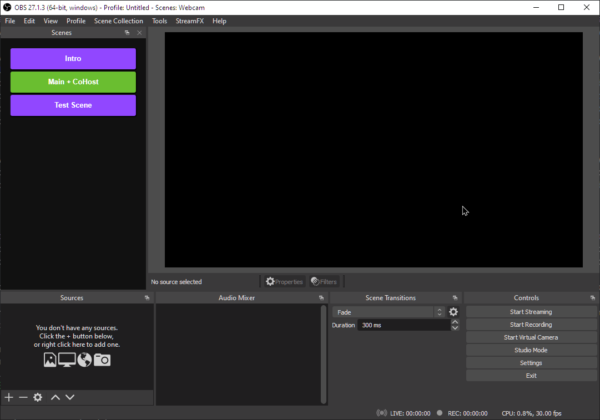

# obs source menu

a cutter menu for listing and selecting obs sources that works via websockets.

\
**INSTALLATION**
1. Clone git repository.
1. Run `npm run build`.
1. Add a Custom Browser Dock in OBS Studio (View/Docks/Custom Browser Docks) with the URL pointing to the generated index.html.
1. Make sure to configure and enable <a href="https://obsproject.com/forum/resources/obs-websocket-remote-control-obs-studio-from-websockets.466/">OBS WebSockets</a> server.

**TO DO**
1. Implement add and remove source functionality.
2. Implement a method for saving and auto completing login form.
